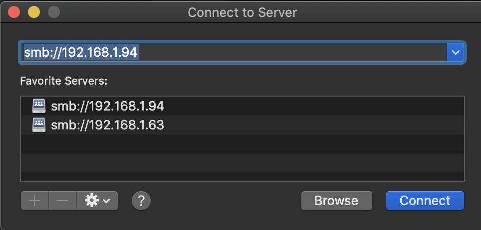

# NAS with samba

## Mount A Drive

If your drive is of other format, such as exfat, follow this https://itsfoss.com/mount-exfat/.

```bash
sudo add-apt-repository universe
sudo apt-get update
sudo apt install exfat-fuse exfat-utils
```

NTFS: `sudo apt-get install ntfs-3g`

## Samba

**Instructions:** https://ubuntu.com/tutorials/install-and-configure-samba#4-setting-up-user-accounts-and-connecting-to-share

```bash
sudo apt update
sudo apt install samba
whereis samba			# check if installation is successful
# sambashare is a placeholder, folder can be any name, path can be any path
mkdir /home/<username>/sambashare/
sudo nano /etc/samba/smb.conf
```

Add the following to the bottom of the file.

```
[sambashare]
    comment = Samba on Ubuntu
    path = /home/username/sambashare
    read only = no
    browsable = yes

```

```bash
sudo service smbd restart	# restart service to make new settings take effect
sudo apt install ufw		# firewall, install if you don't have it installed already
sudo ufw allow samba		# Update the firewall rules to allow Samba traffic
```

```bash
sudo smbpasswd -a $(whoami)		# add user
```


## Connect

### Mac

Open **finder**, `Command + k` to connect to server.

`smb://<ip>/<sambashare>`

or `smb://<ip>/<sambashare>`

 

### Windows

1. `win+r`

2. ```auto
    \\<ip>\<name of share e.g. sambashare>
    ```

### Ubuntu

Same as mac, connect to server

```
smb://<ip>/<sambashare>
```

